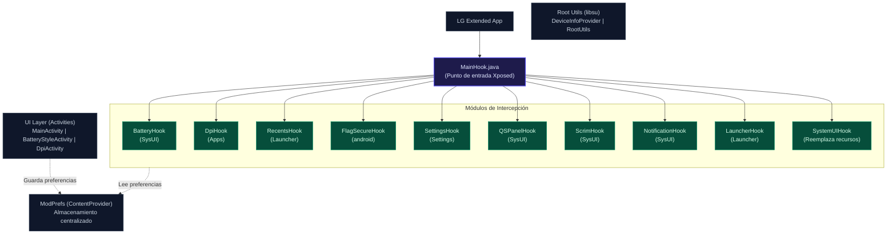
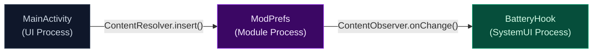
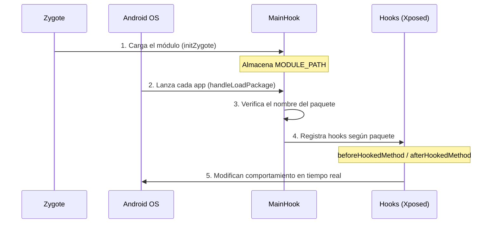
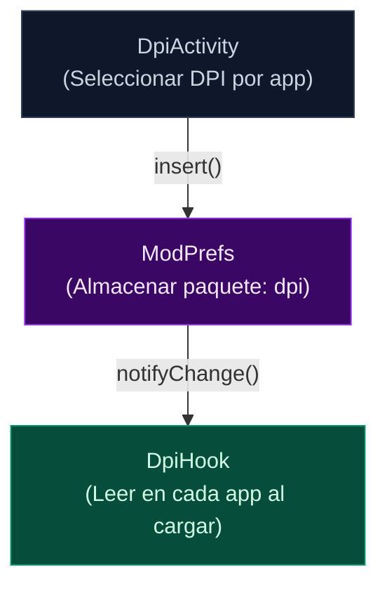

# LG Extended - Complete Documentation

## Table of Contents

1. [Project Summary](#1-project-summary)
2. [Architecture](#2-architecture)
3. [How Hooks Work](#3-how-hooks-work)
- 3.1 [Fundamental Concepts](#31-fundamental-concepts)
- 3.2 [ModPrefs - Communication System](#32-modprefs---communication-system-between-hooks-and-ui)
- 3.3 [BatteryHook](#33-batteryhook---battery-icon-customization)
- 3.4 [DpiHook](#34-dpihook---dpi-change-per-application)
- 3.5 [RecentsHook](#35-recentshook---ios-style-for-multitasking)
- 3.6 [FlagSecureHook](#36-flagsecurehook---bypass-restrictions)
- 3.7 [SettingsHook](#37-settingshook---settings-customization)
- 3.8 [LauncherHook](#38-launcherhook---automatic-app-ordering)
- 3.9 [QSPanelHook](#39-qspanelhook---panel-de-quick-settings-miui)
- 3.10 [ScrimHook](#310-scrimhook---blur-effect-in-systemui)
- 3.11 [NotificationHook](#311-notificationhook---miui-notification-style)
- 3.12 [SystemUIHook](#312-systemuihook---resource-replacement)
- 3.13 [Summary of All Hooks](#313-summary-of-all-hooks)
4. [UI Components](#4-ui-components)
5. [Data Management](#5-data-management)
6. [Root Integration](#6-root-integration)
7. [Build Configuration](#7-build-configuration)
8. [File Structure](#8-file-structure)
9. [Dependencies](#9-dependencies)
10. [Installation Guide](#10-installation-guide)
11. [Troubleshooting](#11-troubleshooting)

---

## 1. Project Summary

**LG Extended** is an Xposed module designed specifically for LG devices (mainly LG V60) that allows you to customize and modify various aspects of the system without having to modify the firmware. The module interacts with multiple system processes to apply changes in real time.

### General Information

| Property | Value |
|-----------|-------|
| **Name** | LG Extended |
| **Package** | `com.zxerox.lg_extended` |
| **Version** | 1.0 (versionCode: 1) |
| **Author** | ZxeroX |
| **Minimal SDK** | Android 10 (API 29) |
| **Target SDK** | Android 15 (API 35) |
| **Framework** | Xposed API 82+ |
| **Requirements** | LSPosed or similar + Root (Magisk/KernelSU/APatch) |

### Description

LG Extended provides a suite of mods for LG devices including:

- **Battery icon customization** with multiple styles (iOS 26, iOS 17, OneUI 8, OneUI 9)
- **DPI change per app** to adjust screen density individually
- **iOS style for recent** that modifies the multitasking design
- **FLAG_SECURE bypass** to allow screenshots in restricted apps
- **Icon customization in Settings** with OneUI style icons
- **Custom profile card** on the main Settings screen

---

## 2. Architecture

### Component Diagram



### Hook Life Cycle

1. **Initialization**: `MainHook.initZygote()` stores the module path (`MODULE_PATH`)
2. **Load**: `MainHook.handleLoadPackage()` detects the target package and registers hooks based on the package
3. **Registration**: Each hook registers for its specific package (with try/catch in case it fails)
4. **Interception**: Hooks modify behavior in real time via `beforeHookedMethod` / `afterHookedMethod`
5. **Persistence**: Preferences are stored via `ModPrefs` ContentProvider
6. **Marked**: MainHook marks each successful hook with `hook_active_{name}` so the UI knows which hooks are running
7. **Logging**: Each registered hook is logged with success/failure via `LogWriter`

#### Packets Each Hook Intercepts

```
handleLoadPackage(lpparam)
    │
    ├── "com.zxerox.lg_extended" → EXCLUIDO (no hook itself)
    │
    ├── CUALQUIER paquete:
    │       └── DpiHook (excepto la app misma)
    │
    ├── "com.android.systemui" o "com.lge.systemui":
    │       ├── QSPanelHook
    │       ├── ScrimHook
    │       ├── NotificationHook
    │       └── BatteryHook
    │
    ├── "com.lge.launcher3" o "com.android.launcher3":
    │       ├── RecentsHook
    │       └── LauncherHook
    │
    ├── "android":
    │       └── FlagSecureHook
    │
    └── "com.android.settings":
            └── SettingsHook
```

### Communication Pattern

The module uses a **ContentProvider** (`ModPrefs`) as a communication system between:
- The configuration app (UI)
- Active hooks in different system processes



---

## 3. How Hooks Work

### 3.1 Fundamental Concepts

A **hook** is a technique that intercepts Android methods at runtime to modify their behavior without altering the original source code. LG Extended uses the **Xposed** framework for this.

#### Life Cycle of a Hook



#### Types of Hooks in Xposed

| Type | When to use | Example |
|------|---------------|---------|
| `beforeHookedMethod` | Before you run the original method | Modify parameters, cancel execution |
| `afterHookedMethod` | After you run the original method | Hide views, inject elements |
| `XC_MethodReplacement` | Completely override the method | Return a fixed value, do nothing |

#### `hookSilently` pattern

RecursHook uses a helper pattern that wraps hooks in try/catch to avoid crashes if a class does not exist:

```java
// Si la clase no existe en esta versión de Android, simplemente se ignora
private void hookSilently(ClassLoader cl, String className, String method, Object... params) {
    try {
        XposedHelpers.findAndHookMethod(className, cl, method, params);
    } catch (Throwable t) {} // Silencioso - no crashea
}
```

---

### 3.2 ModPrefs - Communication System between Hooks and UI

**Authority**: `com.zxerox.lg_extended.prefs`
**URI**: `content://com.zxerox.lg_extended.prefs/prefs`

The hooks and the configuration app communicate through a **ContentProvider** called `ModPrefs`. This allows the UI to change preferences and hooks to read them in real time.


#### Write Preferences (from the UI)

```java
ContentValues values = new ContentValues();
values.put("key", "battery_style");
values.put("type", "string");
values.put("value", "IOS_26");
contentResolver.insert(ModPrefs.CONTENT_URI, values);
// ModPrefs notifica a todos los ContentObserver registrados
```

#### Read Preferences (from a hook)

```java
Cursor c = context.getContentResolver().query(
    ModPrefs.CONTENT_URI,
    new String[]{"battery_style"},  // key a leer
    "string",                        // tipo de dato
    new String[]{"ONEUI_8"},         // valor por defecto
    null
);
if (c != null && c.moveToFirst()) {
    String valor = c.getString(0);
    c.close();
}
```

#### Real Time Update (ContentObserver)

BatteryHook registers an observer to apply style/color changes instantly without restarting SystemUI:

```java
context.getContentResolver().registerContentObserver(
    Uri.parse("content://com.zxerox.lg_extended.prefs/prefs"),
    true, // Notificar si cambia cualquier descendiente
    new ContentObserver(new Handler(Looper.getMainLooper())) {
        @Override
        public void onChange(boolean selfChange) {
            // Re-leer preferencias y actualizar TODAS las vistas de batería
            BatteryIconView.Estilo nuevoEstilo = leerEstiloGuardado(context);
            for (BatteryIconView v : baterias.values()) {
                v.setEstilo(nuevoEstilo);
                aplicarColoresGuardados(context, v);
            }
        }
    }
);
```

#### Marking Active Hooks

MainHook marks each successful hook in ModPrefs with the key `hook_active_{name}`. This allows the UI to show which hooks are running:

```java
// En MainHook.markHookActive()
values.put("key", "hook_active_battery");
values.put("type", "boolean");
values.put("value", "true");
ctx.getContentResolver().insert(ModPrefs.CONTENT_URI, values);
```

---

### 3.3 BatteryHook - Battery Icon Customization

**Target package**: `com.android.systemui` / `com.lge.systemui`
**File**: `hooks/BatteryHook.java`

#### What are you doing

Replaces the native LG battery icon (`LGBatteryMeterView`) with a custom `BatteryIconView` with multiple styles and colors.

#### How it works step by step

**Hook 1: `onAttachedToWindow`** - Executed when the battery view is attached to the view tree

```
LGBatteryMeterView.onAttachedToWindow()
    │
    ├── 1. Obtener referencia a la vista original
    ├── 2. Obtener el padre (ViewGroup)
    ├── 3. Ocultar la vista original (setVisibility GONE)
    ├── 4. Crear BatteryIconView personalizado
    ├── 5. Insertar en el padre MISMA posición que la original
    ├── 6. Registrar en WeakHashMap para tracking
    ├── 7. Aplicar colores guardados desde ModPrefs
    └── 8. Registrar ContentObserver para cambios en tiempo real
```

**Hook 2: `onBatteryLevelChanged`** - Executes when the battery level changes

```
LGBatteryMeterView.onBatteryLevelChanged(level, plugged, charging)
    │
    ├── 1. Ocultar vista original (por si se vuelve visible)
    ├── 2. Ocultar texto de porcentaje (mBatteryLevel)
    ├── 3. Obtener BatteryIconView del WeakHashMap
    └── 4. Llamar actualizarEstado(nivel, cargando)
```

#### Available Styles

| Style | Description |
|--------|-------------|
| `ONEUI_8` | Rounded pill style (default) |
| `ONEUI_9` | Style with loading circle |
| `IOS_26` | iOS style with integrated bolt |
| `IOS_17` | iOS style with border and padding |

#### States and Colors

| Status | Default Background Color | Default Text Color |
|--------|---------------------|---------------------|
| Normal | `#1C1C1E` | White |
| Loading | `#34C759` | White |
| Low Battery (≤20%) | `#FF3B30` | White |

#### Stored Preferences

| Key | Type | Description |
|-----|------|-------------|
| `battery_style` | String | Selected style (ONEUI_8, ONEUI_9, IOS_26, IOS_17) |
| `battery_background_color` | int | Normal background color |
| `battery_text_color` | int | Normal text color |
| `battery_border_color` | int | Normal border color |
| `battery_color_background_charging` | int | Background color loading |
| `battery_color_text_charging` | int | Text color loading |
| `battery_color_border_charging` | int | Border color loading |
| `battery_low_backgroundcolor` | int | Low battery background color |
| `battery_color_text_low` | int | Low battery text color |
| `battery_color_low_border` | int | Low battery border color |

---

### 3.4 DpiHook - DPI Change by Application

**Target package**: All applications (except `com.zxerox.lg_extended`)
**File**: `hooks/DpiHook.java`

#### What are you doing

Modify the screen density (DPI) of each app individually before Android renders the interface.

#### How it works step by step

```
ResourcesImpl.updateConfiguration(config, metrics, compatInfo)
    │
    ├── 1. ¿Primera vez que se ejecuta? (dpiCache == -1)
    │       ├── SÍ: Leer DPI guardado en ModPrefs para este paquete
    │       │       └── Guardar en dpiCache (se cachea para no repetir queries)
    │       └── NO: Usar dpiCache ya almacenado
    │
    ├── 2. ¿dpiCache <= 0? → No hacer nada (usar DPI del sistema)
    │
    └── 3. Modificar Configuration y DisplayMetrics
            ├── config.densityDpi = dpiCache
            ├── metrics.densityDpi = dpiCache
            └── metrics.density = dpiCache * 0.00625f
```

#### Data Flow



#### Stored Preferences

| Key | Type | Description |
|-----|------|-------------|
| `{package_name}` | int | Specific DPI for that app (0 = system default) |

---

### 3.5 RecentsHook - iOS Style for Multitasking

**Target package**: `com.lge.launcher3` / `com.android.launcher3`
**File**: `hooks/RecentsHook.java`

#### What are you doing

Modify the recent view (multitasking) to implement an iOS-like style with stack effects, progressive scaling, and header transparency.

#### What methods does it intercept

This hook uses the `hookSilently` pattern to intercept **10+ methods** without crashing if one does not exist:

| Method | Class | Hook Type | What does it do |
|--------|-------|--------------|----------|
| `get` | `TaskCornerRadius` | before | Round corners at 32dp |
| `setFullscreenProgress` | `TaskView` | after | Applies scale based on progress |
| `setDimAlpha` | `TaskView` | before | Remove blackout (fixed to 0) |
| `setDimAlpha` | `TaskThumbnailView` | before | Eliminates darkening of the thumbnail |
| `setDimAlphaMultipler` | `TaskThumbnailView` | before | Remove blackout multiplier |
| `setStableAlpha` | `TaskView` (×2) | before | Set alpha to 1.0 (no transparency) |
| `setContentAlpha` | `RecentsView` | before | Control alpha of content |
| `onFinishInflate` | `TaskView` | after | Remove elevation (elevation = 0) |
| `onTaskListVisibilityChanged` | `TaskView` | before | Visible force = true |
| `updateStackLayout` | `RecentsView` | before | Cancel original layout (DO_NOTHING) |
| `updateStackProperties` | `RecentsView` | after | **Main hook** - applies stack effect |
| `updateCurveProperties` | `RecentsView` (×2) | after | Reuse the same scrollHook |

#### Stack Effect Logic (scrollHook)

```
RecentsView.updateStackProperties()
    │
    ├── 1. Obtener datos del scroll
    │       ├── count = número de task views
    │       ├── scrollX = posición actual del scroll
    │       └── width = ancho del RecentsView
    │
    ├── 2. Calcular spacing nativo
    │       └── Distancia real entre la primera y segunda task view
    │
    ├── 3. Para CADA task view:
    │       │
    │       ├── Calcular distanceToCenter (distancia al centro de pantalla)
    │       ├── Calcular progress (distancia / spacing)
    │       │
    │       ├── TRANSLACIÓN X:
    │       │   ├── Si está a la izquierda del centro:
    │       │   │   └── translationX = progress * stackGapBehind
    │       │   ├── Si está a la derecha del centro:
    │       │   │   └── translationX = progress * stackGapAhead
    │       │   └── Si está en el centro:
    │       │       └── translationX = 0
    │       │
    │       ├── ESCALA:
    │       │   ├── Primeras 4 apps: 1.0 → 0.97
    │       │   ├── Resto: 0.97 (mínimo 0.70)
    │       │   └── Se interpola con fullscreenProgress
    │       │
    │       ├── PROFUNDIDAD:
    │       │   └── translationZ = child.getLeft() * 0.01
    │       │
    │       └── HEADER (título):
    │           ├── Escala: 0.85
    │           ├── translateY: 15f
    │           └── Alpha: se desvanece con la distancia
    │               └── titleAlpha = max(0, 1 - |progress| * 2.5)
    │
    └── 4. Aplicar todas las transformaciones a la vista
```

#### Design Parameters

| Parameter | Value | Description |
|-----------|-------|-------------|
| `STACK_GAP` | 150f | Distance between apps in stack (behind) |
| `stackGapAhead` | 65% of spacing | Forward Distance |
| Initial scale | 1.0 - 0.97 | Scale for first 4 apps |
| Minimum scale | 0.70 | Minimum scale for distant apps |
| Header scale | 0.85 | App Title Scale |
| Header alpha threshold | 2.5 | Title Fade Factor |

#### Stored Preferences

| Key | Type | Description |
|-----|------|-------------|
| `recents_enabled` | boolean | Enable iOS style in recent |

---

### 3.6 FlagSecureHook - Restriction Bypass

**Target package**: `android` (system process)
**File**: `hooks/FlagSecureHook.java`

#### What are you doing

Disable `FLAG_SECURE`, which prevents screenshots in applications that implement it (banking apps, Netflix, etc.).

#### How it works step by step

```
WindowState.isSecureLocked()
    │
    ├── 1. Recargar preferencias desde archivo XML
    │       └── prefs.reload() (lee directamente de disco)
    │
    ├── 2. Verificar si bypass está habilitado
    │       └── prefs.getBoolean("bypass_flag_secure", true)
    │
    └── 3. Si está habilitado:
            └── param.setResult(false)  ← SIEMPRE retorna false
                (el método original NUNCA se ejecuta)
```

#### Important Technical Detail

This hook uses `XSharedPreferences` instead of `ModPrefs` because it runs in the `android` (system_server) process, where the app's ContentProvider is not available. Reads the preferences XML file directly.

#### Stored Preferences

| Key | Type | Description |
|-----|------|-------------|
| `bypass_flag_secure` | boolean | Enable bypass (default: true) |

---

### 3.7 SettingsHook - Customizing Settings

**Target package**: `com.android.settings`
**File**: `hooks/SettingsHook.java`

#### What are you doing

Make extensive modifications to the Android Settings app:

1. **Custom profile card** on the main screen
2. **Icon replacement** with OneUI style icons
3. **Removal of dividers** for a cleaner look
4. **Icon Tint Lock** to keep original colors
5. **Modification of the AppBar** to enlarge the title area

#### Hook 1: Profile Card (DashboardFragment.refreshAllPreferences)

```
DashboardFragment.refreshAllPreferences()
    │
    ├── 1. Verificar que es TopLevelSettings (pantalla principal)
    ├── 2. Leer perfil desde ModPrefs (name, phrase, avatar)
    ├── 3. Construir vista custom (LinearLayout con avatar + texto)
    ├── 4. Crear LayoutPreference con la vista
    ├── 5. Insertar con order = -999 (siempre arriba)
    ├── 6. Inyectar divider category con order = -998
    └── 7. Modificar AppBar (altura 180dp, título 36sp)
```

#### Hook 2: Icon Replacement (PreferenceGroupAdapter.onBindViewHolder)

```
PreferenceGroupAdapter.onBindViewHolder(holder, position)
    │
    ├── 1. Obtener preferencia en esa posición
    ├── 2. Verificar que hook_settings_icons esté habilitado
    ├── 3. Obtener key de la preferencia
    ├── 4. Buscar icono en el iconMap (18 mapeos)
    ├── 5. Cargar drawable desde recursos del módulo
    │       └── XModuleResources.createInstance(MODULE_PATH)
    ├── 6. Reemplazar ImageView del holder
    └── 7. Quitar tintes y ajustar tamaño a 40dp
```

#### Icon Mapping

| Preference Key | Icon |
|-------------------|-------|
| `top_level_network` | `ic_network_and_internet` |
| `top_level_connected_devices` | `ic_bluetooth` |
| `top_level_sound` | `ic_sound` |
| `top_level_notification` | `ic_notifications` |
| `top_level_display` | `ic_screen` |
| `top_level_theme` | `ic_background_screen_and_theme` |
| `top_level_security` | `ic_lock_screen_and_security` |
| `top_level_privacy` | `ic_privacy` |
| `top_level_location` | `ic_location` |
| `top_level_useful_features` | `ic_extensions` |
| `top_level_apps_and_notifs` | `ic_applications` |
| `top_level_digital_wellbeing` | `ic_digital_wellbeing` |
| `top_level_battery` | `ic_battery` |
| `top_level_storage` | `ic_storage` |
| `top_level_emergency` | `ic_security_and_emergency` |
| `top_level_accounts` | `ic_accounts` |
| `top_level_system` | `ic_system` |
| `top_level_accessibility` | `ic_accessibility` |

#### Hook 3: Tint Lock (DynamicIconColorDecorator)

```
DynamicIconColorDecorator.setIconTint() / setDynamicIconColor()
    │
    ├── 1. Obtener key de la preferencia
    ├── 2. ¿Está en el iconMap?
    │       └── SÍ: param.setResult(null) ← no aplicar tinte
    └── 3. NO: dejar comportamiento original
```

#### Hook 4: Divider Removal

```
PreferenceFragmentCompat.setDivider()        → DO_NOTHING (no-op)
PreferenceFragmentCompat.setDividerHeight()   → args[0] = 0
RecyclerView.addItemDecoration()              → bloquear si contiene "divider"
HIGHelper.isShowDivider()                     → returnConstant(false)
```

#### Stored Preferences

| Key | Type | Description |
|-----|------|-------------|
| `hook_settings_icons` | boolean | Replace settings icons |
| `profile_name` | String | Profile name |
| `profile_phrase` | String | Profile phrase |
| `profile_avatar_base64` | String | Avatar in Base64 |

---

### 3.8 LauncherHook - Automatic App Sorting

**Target package**: `com.lge.launcher3` / `com.android.launcher3`
**File**: `hooks/LauncherHook.java`

#### What are you doing

Automatically sorts apps alphabetically after a new app is installed.

#### How it works

```
AllAppsPagedView.addApps(apps, sessionId)
    │
    ├── 1. Recargar preferencias
    ├── 2. ¿hook_auto_sort_apps está habilitado?
    │       └── NO: No hacer nada
    │
    └── 3. SÍ:
            ├── Obtener enum SortType.NAME
            └── Llamar changeSortType(NAME)
```

#### Stored Preferences

| Key | Type | Description |
|-----|------|-------------|
| `hook_auto_sort_apps` | boolean | Automatically sort apps |

---

### 3.9 QSPanelHook - MIUI Quick Settings Panel

**Target package**: `com.android.systemui` / `com.lge.systemui`
**File**: `hooks/QSPanelHook.java`

#### What are you doing

Makes the background of the Quick Settings panel transparent for a MIUI-style look.

#### How it works

```
QSContainerImpl.onFinishInflate()
    │
    ├── 1. Verificar que pref_enable_miui_qs esté habilitado
    │       (también verifica archivo /data/local/tmp/lg_ext_miui_qs)
    │
    └── 2. Si está habilitado:
            ├── Buscar vista quick_settings_background
            └── setBackgroundColor(Color.TRANSPARENT)
```

#### Stored Preferences

| Key | Type | Description |
|-----|------|-------------|
| `pref_enable_miui_qs` | boolean | Enable MIUI QS style |

---

### 3.10 ScrimHook - Blur Effect in SystemUI

**Target package**: `com.android.systemui` / `com.lge.systemui`
**File**: `hooks/ScrimHook.java`

#### What are you doing

Adds blur effect and adjusts the transparency of the scrim (overlay) in SystemUI.

#### Hooks that intercept

**Hook 1: `ScrimController.attachViews`**

```
ScrimController.attachViews(mScrimBehind, mScrimInFront, mNotificationsScrim)
    │
    ├── 1. Verificar que MIUI QS esté habilitado
    └── 2. Si está habilitado:
            ├── mScrimBehind.setBackgroundBlurRadius(150)
            ├── mDefaultScrimAlpha = 0.4f
            └── mScrimBehindUnblurAlpha = 0.4f
```

**Hook 2: `ScrimController.updateScrims`**

```
ScrimController.updateScrims()
    │
    ├── 1. Verificar que MIUI QS esté habilitado
    └── 2. Si está habilitado:
            └── Si mBehindAlpha > 0.4f:
                    └── mBehindAlpha = 0.4f (limitar transparencia)
```

#### Stored Preferences

| Key | Type | Description |
|-----|------|-------------|
| `pref_enable_miui_qs` | boolean | Enable MIUI QS style |

---

### 3.11 NotificationHook - MIUI Notification Style

**Target package**: `com.android.systemui` / `com.lge.systemui`
**File**: `hooks/NotificationHook.java`

#### What are you doing

Modify the appearance of notifications for a MIUI style: blur backgrounds, custom colors, and hide expand arrow.

#### Hooks that intercept

| Method | Class | Type | What does it do |
|--------|-------|------|----------|
| Builder | `NotificationBackgroundView` | after | Apply blurRadius(50) to the background |
| `setTint` | `NotificationBackgroundView` | before | Apply custom colorFilter |
| `setPinned` | `ExpandableNotificationRow` | after | Adjust opacity of pinned notifications |
| `onFinishInflate` | `NotificationExpandButton` | after | Hidden expand arrow |
| `updateColors` | `NotificationExpandButton` | after | Hidden expand arrow |
| `updateViewWithShelf` | `StackScrollAlgorithm` | after | Hide notifications almost off screen |

#### Tinting hook flow

```
NotificationBackgroundView.setTint(color)
    │
    ├── 1. Verificar que MIUI QS esté habilitado
    ├── 2. Obtener Drawable mBackground
    └── 3. Si color != 0:
            └── bg.setColorFilter(color, SRC)
        Si color == 0:
            └── bg.clearColorFilter()
```

#### Stored Preferences

| Key | Type | Description |
|-----|------|-------------|
| `pref_enable_miui_qs` | boolean | Enable MIUI QS style |
| `pref_hide_notification_arrow` | boolean | Hide notification expand arrow |
| `pref_separate_notification_cards` | boolean | Separate notification cards |

---

### 3.12 SystemUIHook - Resource Replacement

**Target package**: `com.android.systemui` / `com.lge.systemui`
**File**: `hooks/SystemUIHook.java`

#### What are you doing

Implements `IXposedHookInitPackageResources` to replace system resources (drawables, colors, dimensions) with custom module resources.

#### What replaces

| Original Resource | Module Resource |
|------------------|--------------------|
| `ic_indi_noti_button_on` | `qs_tile_background` |
| `ic_indi_noti_button_off` | `qs_tile_background` |
| `notification_material_background_color` | `notification_material_background_color_miui` |
| `notification_material_background_dimmed_color` | `notification_material_background_dimmed_color_miui` |
| `notification_corner_radius` | `notification_corner_radius_miui` |
| `notification_divider_height` | `notification_divider_height_miui` |
| `qs_icon_size` | `qs_icon_size_miui` |

#### Difference with other hooks

This hook does NOT intercept Java methods. Implements `IXposedHookInitPackageResources` which is executed when Android loads the resources of a package. Allows you to replace drawables, colors and dimensions directly.

---

### 3.13 Summary of All Hooks

| Hook | Package | Type | Intercepted Methods |
|------|---------|------|----------------------|
| `BatteryHook` | SystemUI | after × 2 | `onAttachedToWindow`, `onBatteryLevelChanged` |
| `DpiHook` | All apps | before × 1 | `ResourcesImpl.updateConfiguration` |
| `RecentsHook` | Launcher | before/after × 12+ | `TaskView.*`, `RecentsView.*`, `TaskCornerRadius.*` |
| `FlagSecureHook` | android | before × 1 | `WindowState.isSecureLocked` |
| `SettingsHook` | Settings | after/before × 5+ | `DashboardFragment.*`, `PreferenceGroupAdapter.*`, etc. |
| `LauncherHook` | Launcher | after × 1 | `AllAppsPagedView.addApps` |
| `QSPanelHook` | SystemUI | after × 1 | `QSContainerImpl.onFinishInflate` |
| `ScrimHook` | SystemUI | before/after × 2 | `ScrimController.attachViews`, `updateScrims` |
| `NotificationHook` | SystemUI | before/after × 6 | `NotificationBackgroundView.*`, `ExpandableNotificationRow.*`, etc. |
| `SystemUIHook` | SystemUI | resource replacement | Replaces drawables, colors, dimensions |

---

## 4. UI Components

### 4.1 MainActivity - Main Screen

**Description**: Main activity with tab navigation (bottom navigation).

#### Tabs

| Tab | Layout | Function |
|-----|--------|---------|
| Home | `home_tab.xml` | Module status, device info |
| Hooks | `tab_hooks.xml` | Active hook management |
| Logs | `tab_logs.xml` | Viewing module logs |
| Settings | `tab_settings.xml` | Settings (coming soon) |

#### Home Tab Features

- **LSPosed Status**: Check if there are active hooks
- **Root Status**: Detects Magisk/KernelSU/APatch
- **Device info**: Model, Android version, kernel, architecture
- **Restart SystemUI button**: Restart SystemUI to apply changes

### 4.2 BatteryStyleActivity - Battery Style Selector

**Description**: Allows you to select the style of the battery icon and customize colors.

#### Styles with Real Time Preview

<div class="p-6 bg-[#111111] border border-white/10 rounded-2xl my-6 flex flex-col items-center gap-6">
  <div class="flex gap-4 overflow-x-auto w-full justify-center pb-2">
    <div class="px-6 py-4 border border-white/10 rounded-xl bg-white/5 flex flex-col items-center">
      <span class="text-white font-medium mb-2">IOS 26</span>
      <span class="text-green-400 font-mono text-sm">[75]</span>
    </div>
    <div class="px-6 py-4 border border-white/10 rounded-xl bg-white/5 flex flex-col items-center">
      <span class="text-white font-medium mb-2">IOS 17</span>
      <span class="text-white font-mono text-sm">[75]</span>
    </div>
    <div class="px-6 py-4 border border-white/10 rounded-xl bg-white/5 flex flex-col items-center">
      <span class="text-white font-medium mb-2">OneUI 9</span>
      <span class="text-white font-mono text-sm">[75]</span>
    </div>
    <div class="px-6 py-4 border border-white/10 rounded-xl bg-white/5 flex flex-col items-center">
      <span class="text-white font-medium mb-2">OneUI 8</span>
      <span class="text-white font-mono text-sm">[75]</span>
    </div>
  </div>
  <div class="w-full h-px bg-white/10 my-2"></div>
<button class="px-6 py-2.5 bg-blue-500/20 text-blue-400 border border-blue-500/30 rounded-xl hover:bg-blue-500/30 transition-colors w-full max-w-sm cursor-default">
Customize Colors (BottomSheet)
</button>
</div>

#### Color Selector (BottomSheet)

| Status | Options |
|--------|----------|
| Normal | Normal Background, Normal Text |
| Loading | Background Loading, Text Loading |
| Low Battery | Low Battery Background, Low Battery Text |

### 4.3 DpiActivity - DPI Selector

**Description**: List of installed apps with the option to change DPI individually.

#### Characteristics

- **App List**: Shows all non-system apps
- **Current DPI**: Shows the configured DPI or "Default"
- **Edit dialog**: Numeric input for new DPI
- **Auto restart**: Force close the app to apply changes

### 4.4 BypassActivity - Security Bypass

**Description**: Switch to enable/disable FLAG_SECURE bypass.

### 4.5 CustomizeSettingsActivity - Customizing Settings

**Description**: Profile editor for the custom card in Settings.

#### Characteristics

- **Real-time preview**: Show changes as they are edited
- **Avatar selector**: Allows you to choose a gallery image
- **Default avatar**: Generates name initial with circular background
- **Size limit**: Avatar resized to 256x256px maximum

### 4.6 BatteryIconView - Custom Battery View

**Description**: Custom view component that draws the battery icon.

```java
public class BatteryIconView extends View {
    public enum Estilo {
        IOS_26,
        ONEUI_9,
        ONEUI_8,
        IOS_17
    }
    
    // Métodos principales
    public void actualizarEstado(int nivel, boolean cargando);
    public void setEstilo(Estilo nuevoEstilo);
    public void setColoresNormal(int colorFondo, int colorTexto);
    public void setColoresCargando(int colorFondo, int colorTexto);
    public void setColoresBateriaBaja(int colorFondo, int colorTexto);
}
```

---

## 5. Data Management

### 5.1 ModPrefs - Centralized ContentProvider

**Authority**: `com.zxerox.lg_extended.prefs`
**URI**: `content://com.zxerox.lg_extended.prefs/prefs`

#### Operations

| Operation | Method | Description |
|-----------|--------|-------------|
| Read | `query()` | Read a preference for key |
| Write | `insert()` | Write or update a preference |

#### ContentValues ​​format

```java
ContentValues values = new ContentValues();
values.put("key", "nombre_preferencia");
values.put("type", "string|int|boolean");
values.put("value", "valor");
contentResolver.insert(PREFS_URI, values);
```

#### Reading Preferences

```java
Cursor c = contentResolver.query(
    PREFS_URI,
    new String[]{"key_name"},    // projection
    "type",                       // selection (tipo de dato)
    new String[]{"default_value"}, // selectionArgs (valor por defecto)
    null
);
if (c != null && c.moveToFirst()) {
    String value = c.getString(0);
    c.close();
}
```

### 5.2 Log System

**Class**: `LogWriter`

#### Characteristics

- **Storage**: In SharedPreferences via ModPrefs
- **Format**: `YYYY-MM-DD HH:mm:ss | LEVEL | message`
- **Levels**: `OK`, `ERR`, `INFO`
- **Limit**: 200 entries maximum (automatic rotation)

#### LogEntry structure

```java
public static class LogEntry {
    public String timestamp;
    public String level;
    public String message;
}
```

#### Use in Hooks

```java
// En BatteryHook.java
LogWriter.write(ctx, "OK", "BatteryHook", packageName, true);

// Output: "2024-01-15 10:30:45 | OK | BatteryHook applied in com.android.systemui"
```

### 5.3 Data Persistence

| Data | Location | Format |
|------|-----------|---------|
| Preferences | `shared_prefs/lg_extended_prefs.xml` | XML SharedPreferences |
| Logs | Same location (via ModPrefs) | String with newlines |
| Avatar | Same location | Base64 encoded string |

---

## 6. Integration with Root

### 6.1 Libsu dependency

```gradle
implementation 'com.github.topjohnwu.libsu:core:5.2.2'
```

### 6.2 DeviceInfoProvider

**Description**: Get device information using root commands.

#### Obtained Data

| Data | Source |
|------|--------|
| Model | `Build.MANUFACTURER + " " + Build.MODEL` |
| Android version | `Build.VERSION.RELEASE` |
| Build Number | `Build.DISPLAY` |
| Architecture | `Build.SUPPORTED_ABIS[0]` |
| Kernel Version | `uname -r` (via root) |
| Root Manager | Automatic detection |

#### Root Manager Detection

```java
// Prioridad de detección:
1. `su -v` → busca "magisk", "kernelsu", "apatch"
2. `/data/adb/ksu` → KernelSU
3. `/data/adb/ap` → APatch
4. `/data/adb/magisk` → Magisk
5. `su --version` → Root genérico
```

### 6.3 RootUtils

```java
// Verificar root
RootUtils.tieneRoot(); // boolean

// Reiniciar SystemUI
RootUtils.reiniciarSystemUI(() -> {
    // Callback después del reinicio
});
// Equivale a: killall com.android.systemui
```

### 6.4 Using Root in the App

| Function | Root Command |
|---------|--------------|
| Restart SystemUI | `killall com.android.systemui` |
| Force close app | `am force-stop {package}` |
| Verify root | `Shell.getShell().isRoot()` |
| kernel info | `uname -r` |

---

## 7. Build Configuration

### 7.1 Build Files

```
LG_Extended/
├── build.gradle                    # Build script raíz
├── app/
│   └── build.gradle               # Build script del módulo
├── settings.gradle                 # Configuración de dependencias
├── gradle.properties               # Propiedades de Gradle
└── gradle/
    └── libs.versions.toml          # Catálogo de versiones
```

### 7.2 Module Configuration

```gradle
// app/build.gradle
android {
    namespace 'com.zxerox.lg_extended'
    compileSdk {
        version = release(36) {
            minorApiLevel = 1
        }
    }

    defaultConfig {
        applicationId "com.zxerox.lg_extended"
        minSdk 29
        targetSdk 36
        versionCode 1
        versionName "1.0"
    }

    compileOptions {
        sourceCompatibility JavaVersion.VERSION_11
        targetCompatibility JavaVersion.VERSION_11
    }
}
```

### 7.3 Main Dependencies

```gradle
dependencies {
    // Xposed API
    compileOnly 'de.robv.android.xposed:api:82'
    
    // Root (libsu)
    implementation 'com.github.topjohnwu.libsu:core:5.2.2'
    
    // Color Picker
    implementation 'com.github.skydoves:colorpickerview:2.3.0'
    
    // AndroidX
    implementation libs.activity.ktx
    implementation libs.appcompat
    implementation libs.constraintlayout
    implementation libs.material
}
```

### 7.4 Xposed Settings

```xml
<!-- AndroidManifest.xml -->
<meta-data
    android:name="xposedmodule"
    android:value="true" />
<meta-data
    android:name="xposedminversion"
    android:value="82" />
<meta-data
    android:name="xposeddescription"
    android:value="LG Extended - Suite de mods para LG V60" />
```

```properties
# xposed_init
com.zxerox.lg_extended.MainHook
```

### 7.5 Repositories

```gradle
// settings.gradle
repositories {
    google()
    mavenCentral()
    maven { url 'https://api.xposed.info/' }
    maven { url 'https://jitpack.io' }
}
```

---

## 8. File Structure

### 8.1 Project Tree

```
LG_Extended/
├── app/
│   ├── build.gradle
│   ├── libs/                          # Xposed API jar
│   └── src/
│       └── main/
│           ├── AndroidManifest.xml
│           ├── assets/
│           │   └── xposed_init        # Entry point para Xposed
│           ├── java/
│           │   └── com/zxerox/lg_extended/
│           │       ├── MainHook.java           # Entry point principal
│           │       ├── hooks/
│           │       │   ├── BatteryHook.java       # Icono de batería
│           │       │   ├── DpiHook.java           # DPI por app
│           │       │   ├── FlagSecureHook.java    # Bypass FLAG_SECURE
│           │       │   ├── RecentsHook.java       # Estilo iOS recientes
│           │       │   ├── SettingsHook.java      # Personalización Ajustes
│           │       │   ├── LauncherHook.java      # Orden automático apps
│           │       │   ├── QSPanelHook.java       # Panel QS MIUI
│           │       │   ├── ScrimHook.java         # Blur en SystemUI
│           │       │   ├── NotificationHook.java  # Notificaciones MIUI
│           │       │   └── SystemUIHook.java      # Reemplazo recursos
│           │       ├── log/
│           │       │   ├── LogAdapter.java     # Adapter RecyclerView
│           │       │   └── LogWriter.java      # Escritura de logs
│           │       ├── prefs/
│           │       │   └── ModPrefs.java       # ContentProvider
│           │       ├── root/
│           │       │   ├── DeviceInfoProvider.java  # Info del dispositivo
│           │       │   └── RootUtils.java      # Utilidades root
│           │       ├── ui/
│           │       │   ├── AppAdapter.java     # Adapter para lista de apps
│           │       │   ├── BatteryStyleActivity.java  # Selector estilo batería
│           │       │   ├── BypassActivity.java # Toggle bypass
│           │       │   ├── CustomizeSettingsActivity.java  # Editor perfil
│           │       │   ├── DpiActivity.java    # Selector DPI
│           │       │   ├── IosStyleActivity.java # Toggle estilo iOS
│           │       │   └── MainActivity.java   # Activity principal
│           │       └── views/
│           │           └── BatteryIconView.java # Vista personalizada batería
│           ├── keepRules/
│           │   └── rules.keep                 # ProGuard/R8 rules
│           └── res/
│               ├── drawable/                   # Iconos y drawables
│               ├── layout/                     # Layouts de activities
│               ├── mipmap-*/                   # Iconos de launcher
│               ├── values/
│               │   ├── colors.xml              # Colores
│               │   ├── strings.xml             # Strings
│               │   └── themes.xml              # Temas
│               ├── values-night/               # Tema oscuro
│               └── xml/
│                   ├── backup_rules.xml
│                   └── data_extraction_rules.xml
├── iconos_ajustes_oneui_muted/        # Iconos SVG para Ajustes
├── xml icons/                         # Iconos adicionales
├── hook iconos.txt                    # Código de referencia (JADX)
├── nuevohook.txt                      # Investigación de hooks
├── build.gradle
├── settings.gradle
├── gradle.properties
└── gradlew / gradlew.bat
```

### 8.2 Resource Files

#### Main Layouts

| Archive | Description |
|---------|-------------|
| `activity_main_new.xml` | MainActivity with bottom navigation |
| `activity_battery_style.xml` | Drum Style Selector |
| `activity_bypass.xml` | Bypass Toggle |
| `activity_customize_settings.xml` | Profile Editor |
| `activity_dpi.xml` | List of apps for DPI |
| `activity_ios_style.xml` | iOS style toggle |
| `home_tab.xml` | Home tab |
| `tab_hooks.xml` | Hooks tab |
| `tab_logs.xml` | Log tab |
| `tab_settings.xml` | Settings tab |

#### Main Drawables

| Category | Files |
|-----------|----------|
| Settings Icons | `ic_accessibility.xml`, `ic_battery.xml`, `ic_bluetooth.xml`, etc. |
| UI Icons | `ic_home.xml`, `ic_hook.xml`, `ic_log.xml`, `ic_settings.xml` |
| Backgrounds | `bg_card_section.xml`, `bg_main_glass.xml`, `bg_nav_floating.xml` |
| Selectors | `row_selected.xml`, `row_default.xml`, `nav_selector.xml` |

---

## 9. Dependencies

### 9.1 Main Dependencies

| Dependency | Version | Purpose |
|-------------|---------|-----------|
| `de.robv.android.xposed:api` | 82 | Xposed Framework |
| `com.github.topjohnwu.libsu:core` | 5.2.2 | Operaciones root |
| `com.github.skydoves:colorpickerview` | 2.3.0 | Color picker |
| `androidx.activity:activity-ktx` | - | Activity Extensions |
| `androidx.appcompat:appcompat` | - |Backwards compatibility |
| `com.google.android.material:material` | - | Material Design Components |

### 9.2 Compilation Dependencies

| Dependency | Type |
|-------------|------|
| `*.jar` in `libs/` | compileOnly |
| Xposed API | compileOnly |

> **Note**: Xposed API is `compileOnly` because it is provided by the framework at runtime.

---

## 10. Installation Guide

### 10.1 Prerequisites

1. **LG device** (preferably LG V60)
2. **Android 10+** (API 29+)
3. **Root** via Magisk, KernelSU or APatch
4. **LSPosed** (or similar Xposed framework)

### 10.2 Installation Steps

#### Step 1: Install LSPosed

```bash
# Si usas Magisk:
# Descargar LSPosed desde GitHub
# Instalar vía Magisk Manager
# Habilitar en /data/adb/lspd/

# Si usas KernelSU:
# LSPosed suele venir preinstalado
```

#### Step 2: Compile or Download the Module

```bash
# Opción A: Compilar desde código fuente
./gradlew assembleRelease

# Opción B: Descargar APK precompilada
# (Descargar desde releases)
```

#### Step 3: Install the Module

```bash
# Instalar APK como app normal
adb install app-release.apk
```

#### Step 4: Enable in LSPosed

1. Open **LSPosed**
2. Go to **Modules**
3. Search **LG Extended**
4. Enable the module
5. Select scope:
- ☑️ `com.android.systemui`
- ☑️ `com.lge.launcher3` / `com.android.launcher3`
- ☑️ `android`
- ☑️ `com.android.settings`

#### Step 5: Reboot

```bash
# Reiniciar dispositivo o
adb shell reboot
```

### 10.5 Usage

1. Open **LG Extended**
2. Go to **Hooks** to configure each mod
3. Changes are applied in real time (some require SystemUI restart)

---

## 11. Troubleshooting

### 11.1 Common Problems

| Problem | Cause | Solution |
|----------|-------|----------|
| Module does not appear in LSPosed | Not installed correctly | Reinstall APK and enable in LSPosed |
| Hooks not working | Incorrect scope | Verify that all packages are selected |
| Battery icon does not change | SystemUI not restarted | Use "Restart System UI" or reboot button |
| DPI does not apply | App not in scope | Ensure that the app is in the scope of LSPosed |
| Crash when opening Settings | Conflict with hooks | Temporarily disable hooks |

### 11.2 Logs

The module logs can be viewed in:
- **LG Extended** → Tab **Logs**
- **LSPosed** → Logs
- **Logcat** with filter: `LG_Extended`

### 11.3 Debug

```bash
# Ver logs del módulo
adb logcat | grep "LG_Extended"

# Ver logs de Xposed
adb logcat | grep "XposedBridge"

# Forzar reinicio de SystemUI
adb shell killall com.android.systemui

# Ver preferencias del módulo
adb shell cat /data/data/com.zxerox.lg_extended/shared_prefs/lg_extended_prefs.xml
```

---

## Appendix A: Packet Mapping

| Package | Description | Hooks |
|---------|-------------|-------|
| `com.android.systemui` | SystemUI | BatteryHook, QSPanelHook, ScrimHook, NotificationHook, SystemUIHook |
| `com.lge.systemui` | LG SystemUI | BatteryHook, QSPanelHook, ScrimHook, NotificationHook, SystemUIHook |
| `com.lge.launcher3` | LG Launcher | RecentsHook, LauncherHook |
| `com.android.launcher3` | AOSP Launcher | RecentsHook, LauncherHook |
| `android` | System process | FlagSecureHook |
| `com.android.settings` | Settings | SettingsHook |
| `com.zxerox.lg_extended` | This app | (None - excluded) |

---

## Appendix B: Preferences Reference

### Battery Preferences

| Key | Type | Default | Description |
|-----|------|---------|-------------|
| `battery_style` | String | ONEUI_8 | Battery style |
| `battery_background_color` | int | #1C1C1E | Normal background color |
| `battery_text_color` | int | White | Normal text color |
| `battery_border_color` | int | White | Normal border color |
| `battery_color_background_charging` | int | #34C759 | Color background loading |
| `battery_color_text_charging` | int | White | Color text loading |
| `battery_color_border_charging` | int | White | Color border loading |
| `battery_low_backgroundcolor` | int | #FF3B30 | Color low battery background |
| `battery_color_text_low` | int | White | Color text low battery |
| `battery_color_low_border` | int | White | Edge color low battery |

### Recents Preferences

| Key | Type | Default | Description |
|-----|------|---------|-------------|
| `recents_enabled` | boolean | false | Recent iOS style |

### Security Preferences

| Key | Type | Default | Description |
|-----|------|---------|-------------|
| `bypass_flag_secure` | boolean | true | Bypass FLAG_SECURE |

### Settings Preferences

| Key | Type | Default | Description |
|-----|------|---------|-------------|
| `hook_settings_icons` | boolean | false | Replace icons settings |
| `profile_name` | String | LG V60 User | Profile name |
| `profile_phrase` | String | Stock is a suggestion | Profile phrase |
| `profile_avatar_base64` | String | "" | Avatar Base64 |

### Launcher Preferences

| Key | Type | Default | Description |
|-----|------|---------|-------------|
| `hook_auto_sort_apps` | boolean | false | Sort apps alphabetically |

### SystemUI (MIUI) Preferences

| Key | Type | Default | Description |
|-----|------|---------|-------------|
| `pref_enable_miui_qs` | boolean | false | Enable MIUI QS style |
| `pref_hide_notification_arrow` | boolean | false | Hide notification arrow |
| `pref_separate_notification_cards` | boolean | false | Separate notification cards |

### Active Hooks Status (automatic)

| Key | Type | Description |
|-----|------|-------------|
| `hook_active_battery` | boolean | BatteryHook active |
| `hook_active_dpi` | boolean | Active DpiHook |
| `hook_active_recents` | boolean | Active RecentsHook |
| `hook_active_flagsecure` | boolean | FlagSecureHook active |
| `hook_active_settings` | boolean | SettingsHook active |
| `hook_active_launcher` | boolean | LauncherHook active |
| `hook_active_qspanel` | boolean | QSPanelHook active |
| `hook_active_scrim` | boolean | Active ScrimHook |
| `hook_active_notification` | boolean | NotificationHook active |

---

## Appendix C: Credits and Licenses

### Author
- **ZxeroX** - Lead Developer

### Licensed Dependencies

| Bookstore | License |
|----------|----------|
| Xposed Framework | Apache License 2.0 |
| libsu | Apache License 2.0 |
| ColorPickerView | Apache License 2.0 |
| Material Components | Apache License 2.0 |

---

*Documentation generated on: August 2, 2026*
*Document version: 2.0*
